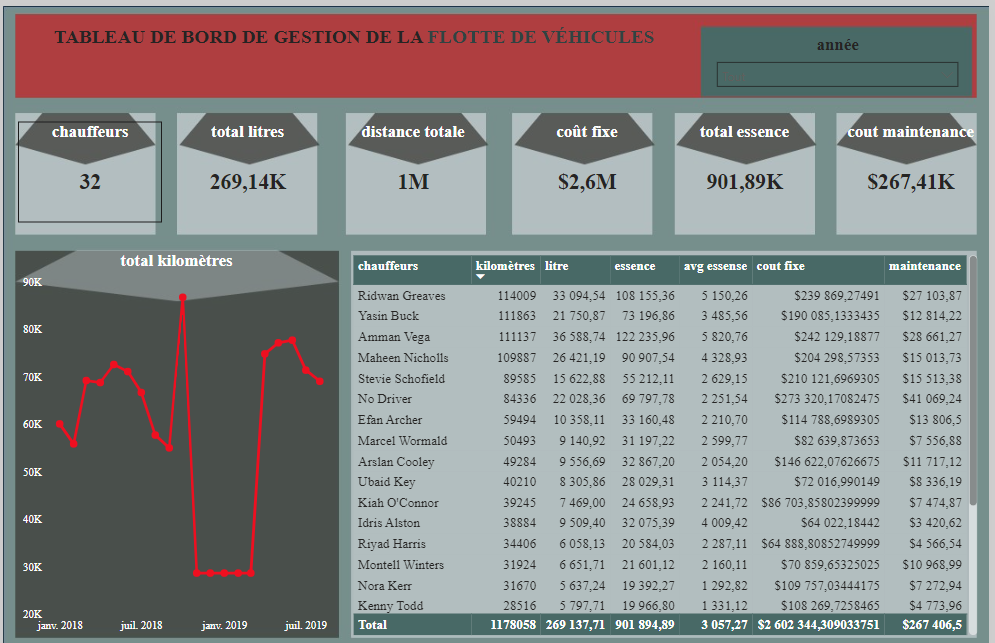

# Fleet Management Dashboard 

The dashboard provides an overview of key metrics related to drivers, including the total number of drivers, total fuel consumption, total distance traveled, fixed costs, total fuel used, and maintenance costs. It also shows a trend of kilometers traveled over the past two years. Additionally, a summary table details the kilometers, fuel usage, average fuel consumption, fixed costs, and maintenance costs for each driver, offering a clear view of individual performance and operational efficiency.

Le tableau de bord fournit un aperçu des principaux indicateurs liés aux chauffeurs, incluant le nombre total de chauffeurs, la consommation totale de carburant, la distance totale parcourue, les coûts fixes, la quantité totale de carburant utilisée et les coûts de maintenance. Il affiche également une tendance des kilomètres parcourus sur les deux dernières années. De plus, un tableau récapitulatif détaille les kilomètres, la consommation de carburant, la consommation moyenne de carburant, les coûts fixes et les coûts de maintenance pour chaque chauffeur, offrant ainsi une vue claire de la performance individuelle et de l'efficacité opérationnelle.

